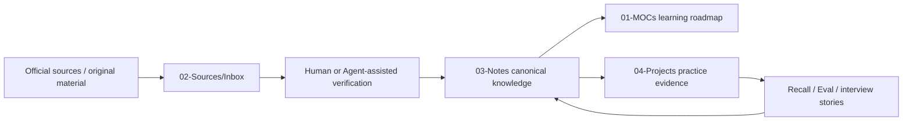
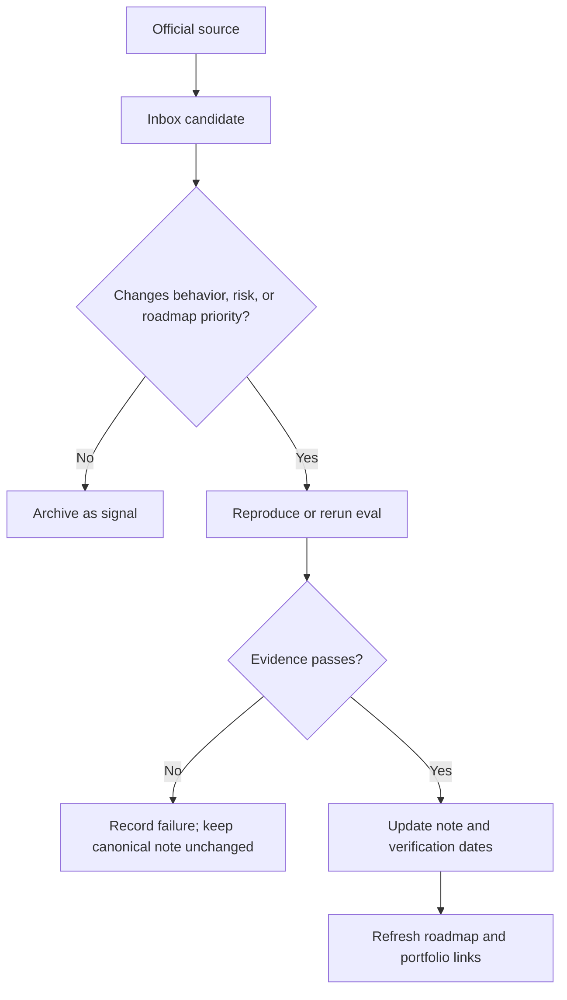

# Personal Agent Knowledge Vault Design

## 1. Context

Current repository already provides useful Obsidian foundations:

- `01-MOCs/` for topic navigation.
- `02-Sources/Inbox/` for automatic raw-source ingestion.
- `03-Notes/` for atomic, human-owned knowledge.
- `04-Projects/` for practical work.
- `06-Daily/` for activity logs.
- Dataview and Templater for dashboards and note creation.
- RSS scanner and source registry for recurring discovery.

Missing layer is not another crawler, course, plugin, or Agent framework. Missing layer is a durable learning loop that connects roadmap, fragmented-time tasks, verified notes, spaced review, practical evidence, and career preparation.

This design evolves current vault. It does not replace directory structure or import another repository wholesale.

## 2. Goals

1. Build personal Agent knowledge repository inside current Obsidian vault.
2. Make Codex primary maintainer while keeping Markdown compatible with Hermes, Claude Code, and OpenCode.
3. Organize Agent knowledge by capability prerequisites instead of framework popularity.
4. Support 10-, 25-, and 60-minute learning sessions.
5. Separate automatically discovered material from verified canonical knowledge.
6. Track knowledge maturity, volatility, verification date, review date, and practical evidence.
7. Convert learning outputs into runnable demos, eval results, architecture explanations, and interview stories.
8. Reuse current Obsidian plugins and RSS pipeline.

## 3. Non-goals

- Building a new Obsidian plugin.
- Building another RSS crawler.
- Forking or depending on an external learning-roadmap branch.
- Copying external course or repository content into canonical notes.
- Generating a large set of empty module notes.
- Automatically rewriting canonical knowledge with LLM output.
- Binding vault operations to one model vendor or coding Agent.
- Publishing personal work logs, credentials, company information, or private job-search material.

## 4. Design Decisions

### 4.1 Keep current vault structure

Current MOC, Sources, Notes, Projects, and Daily separation remains authoritative. New behavior is implemented through one roadmap MOC, one learning-note schema, Dataview views, source additions, and cross-Agent rules.

### 4.2 Markdown is system of record

Canonical state lives in Markdown frontmatter and files. No Agent-specific database becomes required. Codex, Hermes, Claude Code, and OpenCode may provide different interfaces, but must read and write same schema.

### 4.3 Automatic discovery stops at Inbox

Recurring automation may fetch official releases, specifications, changelogs, papers, or security notices into `02-Sources/Inbox/`. Automation cannot directly update canonical notes.

Promotion requires:

1. Relevance decision.
2. Primary-source check.
3. Reproduction, comparison, or explicit reasoning.
4. Target canonical note selection.
5. `last-verified` and `review-after` update.

### 4.4 Mastery requires evidence

Reading or saving a source does not prove mastery. Learning maturity advances only through explanation, experiment, evaluation, or teaching evidence.

Allowed progression:

```text
seed -> practiced -> demonstrated -> teachable
```

- `seed`: question or source captured.
- `practiced`: minimal experiment or retrieval exercise completed.
- `demonstrated`: reproducible artifact and acceptance evidence exist.
- `teachable`: concept can be explained clearly with boundaries, failure cases, and trade-offs.

### 4.5 Reuse before building

Reuse:

- Existing Obsidian structure.
- Dataview dashboards.
- Templater note creation.
- Existing RSS scanner and cron schedule.
- Proven learning mechanisms: retrieval practice, spaced review, gap tracking, source promotion.

Do not adopt:

- Claude Code-only runtime as mandatory dependency.
- Another repository's full directory schema.
- Another source-ingestion service.
- Automatic LLM-written canonical wiki.

## 5. Architecture



### 5.1 Layer responsibilities

| Layer | Location | Responsibility |
|---|---|---|
| Navigation | `01-MOCs/Agent-Learning-Roadmap.md` | Capability map, next task, due review, stale knowledge, portfolio evidence |
| Raw sources | `02-Sources/Inbox/` | Unverified external changes and reading candidates |
| Canonical knowledge | Existing `03-Notes/` subdirectories | Original explanations, validated behavior, boundaries, decisions |
| Practice | `04-Projects/agent-labs/` | Runnable experiments, traces, evals, threat models |
| Daily execution | `06-Daily/` | Session record, interruption point, next action |
| Templates | `_templates/learning-node.md` | Stable metadata and learning-note prompts |
| Agent contract | `AGENTS.md` | Cross-Agent write rules, promotion boundary, resource safety |
| Discovery | `scripts/feeds.yaml` and `scripts/rss_scan.py` | Existing source scanning, scoring, Inbox writing |

## 6. Capability Roadmap

Roadmap uses nine capability modules. Frameworks remain examples, not module boundaries.

| Module | Focus | Required evidence |
|---|---|---|
| M0 | Scenario judgment and LLM I/O | Agent/not-Agent decision, structured-output tests |
| M1 | Minimal Agent loop and tool contract | Framework-free loop, trace, tool-selection tests |
| M2 | Context, retrieval, and memory | Retrieval eval, memory policy, conflict test |
| M3 | Harness and recoverable execution | State model, checkpoint/resume trace, failure matrix |
| M4 | Evaluation and observability | Eval dataset, version comparison, failure taxonomy |
| M5 | Security, identity, and human control | Threat model, adversarial tests, permission policy |
| M6 | Skills and Agent protocols | Tested skill, MCP demo, protocol-boundary explanation |
| M7 | Planning, delegation, and multi-Agent | Single/multi-Agent comparison, ownership contract |
| M8 | Specialized Agent and production delivery | Runnable capstone, eval report, trace, limitations |

Recommended career bias:

- Main line: Agent application and systems engineering.
- Specialization: coding, research, or browser Agent.
- Personal differentiator: Android/Flutter Agent reliability, task-scoped permission, weak-network recovery, and mobile privacy.

## 7. Fragmented-Time Protocol

Every learning item must fit one execution size:

| Timebox | Action | Required output |
|---:|---|---|
| 10 minutes | Recall one concept or inspect one official delta | Short answer, open question, or update candidate |
| 25 minutes | Run one minimal lab, inspect one trace, or add one eval | Diff, result, failure note, or next action |
| 60 minutes | Integrate modules, inject failure, or improve project | Runnable increment, comparison, diagram, or report |

Interruption rules:

- `next-action` must contain one concrete action.
- Save current assumption, result, and recovery command.
- Do not open new topic when an existing experiment lacks outcome.
- If only 30 minutes remain in a week, rerun one old eval and fix one failure.

## 8. Learning Node Schema

```yaml
type: learning-node
module: M1
maturity: seed
timebox: 25
volatility: medium
prerequisites: []
created:
updated:
last-verified:
review-after:
source-of-truth: []
artifact:
eval:
next-action:
recall-prompts: []
tags: [ai-agent]
```

Field rules:

- `module`: one value from `M0` through `M8`.
- `maturity`: `seed`, `practiced`, `demonstrated`, or `teachable`.
- `timebox`: `10`, `25`, or `60`.
- `volatility`: `low`, `medium`, or `high`.
- `source-of-truth`: official specification, official documentation, original paper, or official repository.
- `artifact`: local project or evidence path.
- `eval`: acceptance result or evaluation artifact path.
- `next-action`: one concrete action; empty only when node has no active follow-up.
- `recall-prompts`: questions, not copied answers.

## 9. Dashboard Views

Roadmap MOC provides four primary Dataview views:

### Next

Learning nodes with non-empty `next-action`, grouped or filtered by `timebox`.

### Due

Notes where `review-after` is today or earlier.

### Stale

High-volatility notes whose `last-verified` exceeds defined review interval or whose status is explicitly `stale`.

### Portfolio

Notes at `demonstrated` or `teachable` maturity with non-empty `artifact` and `eval`.

Dashboard also displays module progression and current weekly focus. Queries must tolerate an empty vault and missing optional fields.

## 10. Update Workflow

### 10.1 Source priority

1. Official specifications and release notes.
2. Official product/API documentation and changelogs.
3. NIST, OWASP, and other primary security sources.
4. Original papers and benchmark repositories.
5. Official framework/SDK releases and migration guides.
6. Original job descriptions for career weighting.
7. Community content only as discovery signal.

### 10.2 Cadence

| Cadence | Action |
|---|---|
| Daily automatic | Existing RSS scanner writes candidates to Inbox |
| Weekly, 20 minutes | Review breaking, security, and evaluation deltas |
| Monthly, 60 minutes | Process due reviews and rerun high-volatility examples |
| Quarterly | Reweight roadmap using practice results and target-role signals |
| Event-triggered | Review protocol breaking changes or severe security notices |

### 10.3 Promotion flow



## 11. Cross-Agent Contract

All supported Agents must follow `AGENTS.md`.

Core rules:

- Read root `AGENTS.md` before changing vault content.
- Treat human-authored notes as user data.
- Never overwrite, delete, or bulk-move human notes without explicit instruction.
- New Agent-generated learning content starts at `seed`.
- Never claim `demonstrated` without linked evidence.
- Preserve source URLs, verification dates, and uncertainty.
- Keep provider-specific commands optional; canonical notes remain provider-neutral.
- Automatic ingestion writes only to Inbox.
- Never store credentials, company-confidential content, or unredacted private traces.
- Avoid full-repository code indexing for Markdown vault tasks.

## 12. Failure Handling

| Failure | Behavior |
|---|---|
| One source cannot be fetched | Log source failure and continue remaining sources |
| Candidate lacks required metadata | Keep in Inbox; do not promote |
| Official behavior changes | Mark canonical note `stale`; verify before rewrite |
| Agent output conflicts with human note | Preserve human note; record conflict for review |
| Reproduction fails | Record failure and evidence; do not change canonical claim |
| Dataview field missing | Query omits or labels item instead of failing dashboard |
| Duplicate candidate appears | Preserve one source record; avoid duplicate canonical notes |
| Sensitive data detected | Stop promotion, redact local artifact, require credential rotation when applicable |
| Index or Agent concurrency causes resource pressure | Stop new work, release optional MCP processes, use scoped search |

## 13. Security and Privacy

- Secrets must come from environment or local ignored configuration.
- Process diagnostics must redact command arguments.
- Public examples must use synthetic data and redacted traces.
- Company code, logs, customer data, internal endpoints, and private job-search data remain outside public material.
- Before any public release, run secret scanning and review Git history, not only current files.
- Existing hardcoded credentials and process-argument credentials require removal and rotation before repository publication.

## 14. Planned File Changes

First implementation phase:

1. Add `01-MOCs/Agent-Learning-Roadmap.md`.
2. Add `_templates/learning-node.md`.
3. Add roadmap link to `01-MOCs/00-Home.md` and `01-MOCs/AI-Agents-MOC.md`.
4. Extend `AGENTS.md` with knowledge-promotion and cross-Agent rules.
5. Merge selected official sources into existing `scripts/feeds.yaml` without replacing user edits.
6. Add one M1 pilot learning node and one `04-Projects/agent-labs/` project index.
7. Keep research evidence in `research/agent-learning-landscape-2026.md`.

Second phase starts only after M1 pilot proves workflow:

1. Add more learning nodes from real work.
2. Add eval, trace, and threat-model templates when first project needs them.
3. Adjust timeboxes using recorded recovery cost.
4. Add source-health or stale-note automation only if Dataview and current RSS workflow become insufficient.

## 15. Verification

### Static checks

- Markdown frontmatter parses as YAML.
- Required fields use allowed enum values.
- Wikilinks resolve or are clearly intentional future references.
- Dataview blocks use installed syntax.
- `git diff --check` passes.
- Secret scan reports no committed credentials in new files.

### Runtime checks

- Open roadmap in Obsidian with no learning nodes; dashboard still renders.
- Create one node from template; it appears in correct Next and Due views.
- Add artifact and eval, advance maturity to `demonstrated`; it appears in Portfolio.
- Mark note stale; it appears in Stale.
- Run RSS scanner with `--dry-run`; no files or state change.
- Run one selected official feed through current scanner.

### Cross-Agent checks

- Codex reads `AGENTS.md` and creates a compliant seed node.
- Second available Agent reads same file and produces compatible frontmatter.
- Neither Agent promotes content without primary-source and evidence fields.

## 16. Success Criteria

- User finds one actionable learning task from roadmap within 10 minutes.
- 10-, 25-, and 60-minute tasks each leave a clear recovery point.
- Dashboard renders Next, Due, Stale, and Portfolio views.
- Every canonical learning note has source, verification date, and review date.
- No automated process overwrites canonical notes.
- At least one M1 learning node reaches `demonstrated` with runnable evidence.
- Any supported Agent can maintain vault through root contract and plain Markdown.

## 17. Risks and Mitigations

| Risk | Mitigation |
|---|---|
| Metadata maintenance becomes work itself | Keep required fields small; add automation only after repeated pain |
| Route becomes another checklist | Require artifact or eval for maturity advancement |
| RSS restores information overload | Limit official sources and prioritize breaking/security/eval changes |
| Agent-generated text pollutes personal knowledge | Inbox boundary and `seed` default |
| Tool-specific instructions fragment behavior | Root provider-neutral contract |
| Empty module scaffolding creates false progress | Start with one M1 pilot; add nodes from real learning |
| Personal vault becomes hard to publish | Treat publication as separate future extraction, not current design goal |
| Heavy indexing or Agent concurrency repeats memory incident | Follow resource preflight in `AGENTS.md` |

## 18. Source Research

Detailed primary-source review, current protocol landscape, and adjacent-project comparison live in:

- `research/agent-learning-landscape-2026.md`

External roadmap repositories remain inspiration only. This design has no dependency on their branches, file paths, or release cadence.
