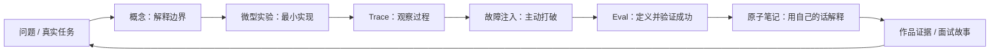
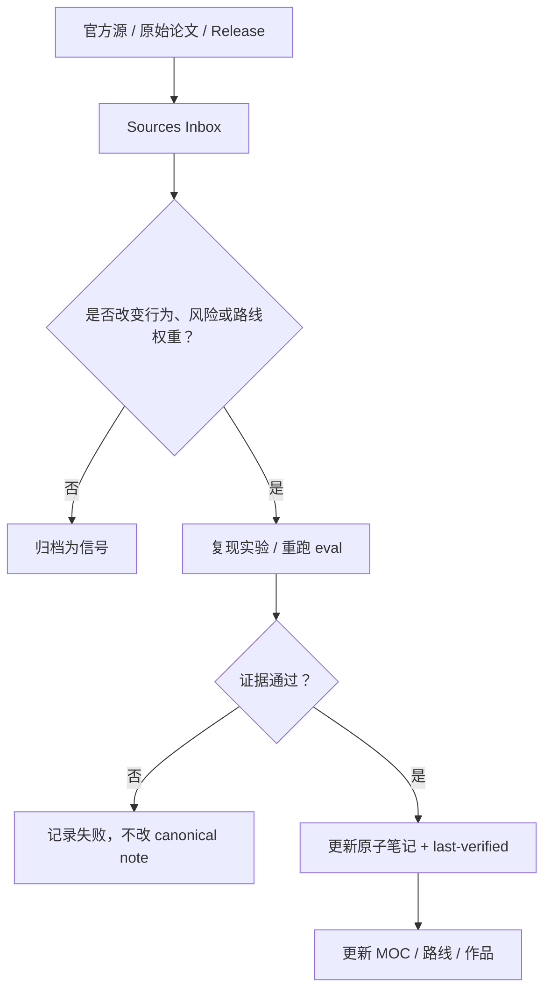

# Agent AI 学习路线与开放知识库定位（2026）

> 研究日期：2026-07-30
>
> 目标：为碎片化工作时间设计一条可执行、可复习、可更新、可转化为求职作品的 Agent AI 学习路线。
>
> 边界：`datawhalechina/Agent-Learning-Hub` 仅作结构灵感，不复制其文本，不依赖其分支、文件路径或更新节奏。核心知识回到官方规范、官方文档和原始论文。

## 结论

本仓库最有价值的开源方向，不是另一份 Agent 链接大全，也不是另一套从头读到尾的课程，而是：

> **Agent Learning OS：面向在职工程师的 Obsidian 原生、证据驱动、可持续更新的 Agent 系统学习操作台。**

它应该同时完成五件事：

1. 把 Agent 知识组织成有先修关系的能力图，而非按热点堆链接。
2. 把每个知识点压成 10/25/60 分钟可中断任务，适配工作间隙。
3. 每个模块必须留下可运行代码、trace、eval、威胁模型或架构说明等证据。
4. 通过官方源 watcher、`last-verified` 和变更差异控制知识过期。
5. 把学习产物自动汇总成求职作品包，而非学完后重新整理。

这也是与现有课程、路线图和个人知识库拉开差异的关键。

## 1. 上游项目可借鉴什么

[Agent-Learning-Hub](https://github.com/datawhalechina/Agent-Learning-Hub) 当前采用单 README 展示面，包含分阶段 todo、项目阶梯、按用途整理的资源表，并强调 tool use、harness、skills、协议、评测和安全。它解决的是“先学什么、参考什么”。

可借鉴：

- 用清晰学习顺序降低新手选择成本。
- 每一阶段配套可交付产物。
- 把项目按学习目的分类，而非按 star 排序。
- 明确指出哪些旧框架只需了解，不应成为学习主线。

不应照搬：

- 单向线性阶段不适合长期、碎片化学习；中断后恢复成本高。
- README checklist 只能记录完成，不能证明掌握。
- 链接表会随协议和产品变化快速老化。
- 通用路线不能利用本仓库已有 Android、客户端架构和个人 Agent 实践优势。
- 若内容层直接依赖上游分支，知识库的稳定性、来源责任和更新节奏都受外部仓库控制。

因此，本路线使用“**能力螺旋 + 证据门槛 + 定期重验**”，而非复制上游阶段。

## 2. 2026 年应建立的领域认知

### 2.1 Agent 是系统，不是框架名称

Anthropic 区分 workflow 与 agent：workflow 由预定义代码路径编排，agent 则由模型动态决定过程和工具使用；同时建议只有在可测地提升结果时才增加复杂度。[Anthropic, Building effective agents](https://www.anthropic.com/engineering/building-effective-agents)

OpenAI 给出的最小构成是 model、tools、instructions，并把循环、退出条件、guardrails 视为系统设计部分；其指南也建议先把单 agent 做到足够好，再在复杂逻辑或工具选择确实失效时拆成多 agent。[OpenAI, A practical guide to building agents](https://openai.com/business/guides-and-resources/a-practical-guide-to-building-ai-agents/)

学习含义：

- 第一目标不是熟记 LangGraph、AutoGen 或某个 SDK API。
- 第一目标是能脱离框架解释并实现 loop、tool contract、state、termination、failure handling。
- 框架用于对比工程权衡，不是知识结构主干。

### 2.2 Tool use、context、memory、protocol 必须分开理解

ReAct 研究把推理轨迹与环境动作交错，展示“思考—行动—观察”如何更新计划；Toolformer 研究则聚焦模型何时调用 API、传什么参数、如何吸收结果。这两者提供 tool-use 的基础思想，不等于生产 harness。[ReAct](https://arxiv.org/abs/2210.03629)；[Toolformer](https://arxiv.org/abs/2302.04761)

RAG 原始工作把参数化模型与显式非参数记忆结合，目标之一是让知识可更新、结果可追溯；这与“把所有历史都塞进上下文”不是同一方案。[Retrieval-Augmented Generation for Knowledge-Intensive NLP Tasks](https://arxiv.org/abs/2005.11401)

学习含义：

- tool 是动作接口。
- context 是当前运行所需信息预算。
- retrieval 是按需取回外部知识。
- memory 是跨轮次或跨任务保存、选择、更新信息的策略。
- protocol 是不同边界间通信契约。
- skill 是可发现、可版本化的流程知识包。

### 2.3 Skills、MCP、A2A、ACP 解决不同边界

| 能力 | 解决问题 | 2026-07-30 学习锚点 |
|---|---|---|
| Agent Skills | 如何封装可复用流程知识 | 官方规范要求 skill 目录至少含 `SKILL.md`，可带 scripts、references、assets，并强调按需渐进加载。[Agent Skills specification](https://agentskills.io/specification) |
| MCP | Agent/LLM 应用如何连接工具和上下文 | 2026-07-28 规范定义 host/client/server、JSON-RPC、resources/prompts/tools，并将核心改为无状态请求，增加 Tasks、Skills over MCP、MCP Apps 等扩展。[MCP 2026-07-28 specification](https://modelcontextprotocol.io/specification/2026-07-28) |
| A2A | 独立、可能不透明的 agent 如何发现能力并协作 | 官方规范覆盖能力发现、交互模态、协作任务和不暴露内部 memory/tools 的互操作。[A2A specification](https://a2a-protocol.org/latest/specification/) |
| ACP | 编辑器/客户端如何连接 coding agent | ACP 稳定 wire protocol 当前为 v1，兼容性由初始化时协商的 `protocolVersion` 和 capabilities 决定，而非 SDK 包版本。[ACP repository](https://github.com/agentclientprotocol/agent-client-protocol) |

学习含义：先画清信任边界和数据流，再学协议字段。能运行 hello world 不等于理解授权、版本协商、取消、长任务和审计。

### 2.4 Harness、eval、安全已是主干，不是“上线后再补”

Anthropic 将 eval trial 的 transcript/trace 与最终 outcome 区分，建议组合 code-based、model-based、human graders；早期可从真实失败抽取 20–50 个任务开始，而非等待大数据集。[Anthropic, Demystifying evals for AI agents](https://www.anthropic.com/engineering/demystifying-evals-for-ai-agents)

MCP 2026-07-28 规范明确要求重视用户同意、数据隐私、工具安全和访问控制；工具描述本身也不能默认可信。[MCP security and trust](https://modelcontextprotocol.io/specification/2026-07-28)

NIST 把 indirect prompt injection、poisoned models、specification gaming、权限范围和运行时监控列为 Agent 系统独特安全关注点；OWASP 2026 Agentic Top 10 进一步覆盖 agent behavior hijacking、tool misuse、identity/privilege abuse 等风险。[NIST CAISI agent security RFI](https://www.nist.gov/news-events/news/2026/01/caisi-issues-request-information-about-securing-ai-agent-systems)；[OWASP Top 10 for Agentic Applications](https://genai.owasp.org/2025/12/09/owasp-genai-security-project-releases-top-10-risks-and-mitigations-for-agentic-ai-security/)

学习含义：

- 每个项目从首周就保存 trace、成本、延迟、工具调用和终态。
- 每个写操作都考虑最小权限、预览、确认、幂等、回滚和审计。
- eval 与 threat model 是作品的一部分，不是附录。

### 2.5 长任务能力增加，更需要可恢复执行与人类控制

Anthropic 2026 年长任务实践把 test oracle、persistent memory、orchestration 作为多日 agent 工作的关键支撑；其可信 Agent 研究同时强调 human control、透明度、隐私和多层安全防御。[Long-running Claude for scientific computing](https://www.anthropic.com/research/long-running-Claude)；[Trustworthy agents in practice](https://www.anthropic.com/research/trustworthy-agents)

学习含义：未来竞争力不只是 prompt 技巧，而是能设计 durable task、checkpoint、resume、budget、approval 和 failure recovery。

## 3. 原创学习路线：九模块能力螺旋

路线不是九章读完。每周都执行同一闭环：



### M0. 场景判断与 LLM I/O

掌握：

- chatbot、deterministic workflow、agent、multi-agent 的边界。
- token/context、messages、structured output、streaming、模型错误类型。
- 什么任务不该用 agent：步骤稳定、规则明确、普通程序成本更低时。

微任务：

- 10 分钟：为一个工作场景写“agent / 非 agent”判断和理由。
- 25 分钟：让 API 输出经 schema 校验的结构化对象。
- 60 分钟：比较 deterministic workflow 与 LLM 决策的成功率、成本和延迟。

证据门槛：

- 一页 ADR：为什么这里需要/不需要 agent。
- 10 条边界测试。

面试信号：能做产品和工程取舍，不把 LLM 塞进所有流程。

### M1. 最小 Agent Loop 与 Tool Contract

掌握：

- observe/decide/act loop。
- tool schema、参数校验、错误返回、timeout、retry、idempotency。
- max steps、stop condition、dead loop 检测。
- tool result 作为不可信输入处理。

微任务：

- 手写一个只含 calculator、search、read-file 的裸 loop。
- 制造空结果、格式错误、工具超时、重复调用。
- 为同一工具写“含糊描述”和“精确描述”，比较选择正确率。

证据门槛：

- 不依赖 agent 框架的最小实现。
- 结构化 trace。
- 至少 12 个工具选择测试。

面试信号：能解释模型、harness、工具执行器各自责任。

### M2. Context、Retrieval 与 Memory

掌握：

- context selection、压缩、摘要、引用和 provenance。
- chunk、embed、retrieve、rerank、grounded answer。
- working memory、session memory、long-term memory 的生命周期。
- 写入门槛、遗忘、冲突解决、用户删除和隐私。

微任务：

- 对同一资料做 full-context、keyword retrieval、vector retrieval 对比。
- 设计“什么不应进入长期记忆”的规则。
- 注入过期事实，测试 agent 是否能发现冲突。

证据门槛：

- retrieval eval：coverage、groundedness、citation correctness。
- memory policy 与数据删除流程。

面试信号：能把“上下文窗口更大”与“信息治理更好”区分开。

### M3. Harness 与可恢复执行

掌握：

- session、state machine、event log、checkpoint、resume、cancel。
- concurrency、queue、backpressure、budget、rate limit。
- sandbox、filesystem/shell/browser 边界。
- context compaction 与跨会话交接。

微任务：

- 杀掉运行中进程，再从 checkpoint 恢复。
- 模拟重复 delivery，验证幂等。
- 给长任务设置时间、token、费用三种预算。

证据门槛：

- 状态图。
- 一次成功恢复 trace。
- 故障矩阵：网络、模型、工具、进程、权限。

面试信号：能从 demo 升级到可靠 runtime。

### M4. Evaluation 与 Observability

掌握：

- task、trial、transcript、outcome、grader、metric。
- deterministic grader、LLM judge、human review 的适用边界。
- pass@k、success rate、latency、cost、tool-call count、failure taxonomy。
- regression set、trace review、线上反馈回流。

微任务：

- 从自己的 5 个失败扩展出 20 个 eval case。
- 给每个 case 写可判定 success criteria 和 reference solution。
- 同一任务跑多次，观察方差。

证据门槛：

- 至少 20 个任务的 eval 数据集。
- 一份前后版本对比报告。
- 三个真实失败的 root-cause 复盘。

面试信号：不以“看起来能跑”证明可靠。

### M5. Security、Identity 与 Human Control

掌握：

- direct/indirect prompt injection、data exfiltration、tool abuse。
- least privilege、task-scoped credentials、secret isolation。
- read/write/irreversible action 分级。
- preview、human approval、audit log、revocation。
- supply-chain、第三方 MCP/skill 信任。

微任务：

- 在网页或文档中植入恶意指令，观察 agent 是否越权。
- 给写操作增加 dry-run、diff、二次确认。
- 把永久 credential 改成任务级短期 credential。

证据门槛：

- threat model 与 trust-boundary 图。
- 10 个 adversarial tests。
- 权限策略表和一次阻断日志。

面试信号：能把模型安全、应用安全、身份授权分层讨论。

### M6. Skills 与 Agent Protocols

掌握：

- skill 发现、触发、渐进加载、脚本和资产。
- MCP tools/resources/prompts、传输、auth、版本协商、长任务扩展。
- A2A capability discovery、task 生命周期、跨 agent 信任。
- ACP session、client/agent capabilities、编辑器集成。

微任务：

- 把一个已经稳定执行的真实流程封装成 skill，而非先写空泛 skill。
- 实现只读 MCP server，再增加一个需确认的写工具。
- 画一张 Skill/MCP/A2A/ACP 边界图，并为错误用法举例。

证据门槛：

- 一个带 smoke test/eval 的 skill。
- 一个带 auth、错误处理和审计的 MCP demo。
- 协议版本兼容说明。

面试信号：懂互操作契约，不只会装 server。

### M7. Planning、Delegation 与 Multi-Agent

掌握：

- decomposition、planner/executor、router、reviewer。
- handoff schema、ownership、stop condition、冲突解决。
- parallelism 收益与 context/coordination 成本。
- 什么时候单 agent + tools 更好。

微任务：

- 同一任务分别用单 agent 与双 agent 实现。
- 固定模型和测试集，比较成功率、成本、延迟。
- 构造循环委派和责任空洞，加入防护。

证据门槛：

- 只有 eval 显示净收益时，作品才保留 multi-agent 版本。
- 清晰 delegation contract 和 ownership map。

面试信号：把 multi-agent 当分布式系统问题，不当角色扮演。

### M8. 专项 Agent 与生产交付

建议只选一主一辅：

- 主线：coding agent / research agent / browser-computer-use agent。
- 差异化辅线：Android/Flutter 本地 Agent、端云协同、移动端隐私与权限。

掌握：

- 明确用户、输入、成功终态、风险、成本上限。
- deploy、CI、monitoring、rollback、docs、example。
- 用户反馈进入 eval 和 roadmap 的闭环。

证据门槛：

- 陌生人能按 README 运行。
- 可复现实验、eval 报告、trace 样例、威胁模型。
- 一份“做了什么取舍、为什么”的架构说明。

面试信号：展示完整系统能力和领域优势。

## 4. 碎片时间执行协议

固定时长是本路线的设计约束，不声称某个分钟数具有普遍最优性。学习机制来自两条成熟证据：

- 检索练习比反复阅读更有利于长期保持，并能促进概念性学习。[Roediger & Karpicke, The Power of Testing Memory](https://pubmed.ncbi.nlm.nih.gov/26151629/)；[Karpicke & Blunt, Retrieval Practice Produces More Learning](https://pubmed.ncbi.nlm.nih.gov/21252317/)
- 分散复习的最优间隔随目标保持时间增加而增长；因此路线需要跨天、跨周回访，而非一次性刷完。[Cepeda et al., Spacing Effects in Learning](https://pubmed.ncbi.nlm.nih.gov/19076480/)

### 4.1 三种任务粒度

| 可用时间 | 只做一种事 | 输出 |
|---|---|---|
| 10 分钟 | Recall：不看笔记回答一个问题；或读一个官方 changelog delta | 3–5 句回忆、一个疑问、一个更新候选 |
| 25 分钟 | Lab：写最小实验、补一个 eval、读一段 trace | commit/diff、测试结果、failure note |
| 60 分钟 | Integrate：跨模块整合、故障注入、重构作品 | 可运行增量、架构图、eval 对比 |

规则：

- 每个任务必须有明确恢复点：`next-action` 不超过一句。
- 阅读不能单独标记“掌握”；必须产生 recall prompt、实验或解释。
- 中断时保存假设、当前输出、下一命令，避免下次重建上下文。
- 同一概念在 1 天、1 周、1 月后以不同问题回访；具体间隔由实际遗忘和使用频率调整。

### 4.2 一周最小闭环

| 时间 | 动作 |
|---|---|
| 周一 10 分钟 | 空白回忆上周概念；选本周一个真实问题 |
| 周二 25 分钟 | 最小实现 |
| 周三 25 分钟 | 读 trace，标记失败类型 |
| 周四 25 分钟 | 故障注入或安全测试 |
| 周五 10 分钟 | 检查官方源变更 |
| 周末 60–90 分钟 | 集成、跑 eval、写一页 teach-back |

若一周只剩 30 分钟：优先“跑一次旧 eval + 修一个失败”，不要另开新主题。

## 5. 12 周求职导向主线

| 周 | 主模块 | 可展示产物 |
|---|---|---|
| 0 | 基线 | 20 题自测；现有项目能力雷达；目标岗位 10 份 JD 技能频次 |
| 1 | M0 | agent/not-agent ADR；structured output demo |
| 2 | M1 | 裸 tool loop + 12 个测试 |
| 3 | M2 | 带引用的 research/RAG agent |
| 4 | M2 | memory policy + 冲突/删除测试 |
| 5 | M6 | skill + MCP server |
| 6 | M3 | checkpoint/resume harness |
| 7 | M4 | 20–50 task eval suite + trace dashboard |
| 8 | M5 | threat model + adversarial tests + approval gate |
| 9 | M8 | coding 或 browser agent 专项 |
| 10 | M7 | 单/多 agent 对照实验；无收益则保留单 agent |
| 11 | M8 | Android/Flutter 或个人知识 Agent 差异化集成 |
| 12 | 交付 | 开源 README、架构图、demo、eval 报告、失败复盘、面试故事 |

完成标准不是“看完资料”，而是：

- 能用 3 分钟白板解释系统边界。
- 能运行 demo。
- 能展示 trace 与失败。
- 能用 eval 数据解释一次取舍。
- 能指出安全边界和已知限制。

## 6. 在当前 Obsidian 仓库中的落位建议

当前仓库已经具备正确骨架：

- `01-MOCs/`：主题入口。
- `02-Sources/Inbox/`：自动摄入的原始信息。
- `03-Notes/`：原子概念、Agents、Skills、MCPs。
- `04-Projects/`：短期项目。
- `06-Daily/`：运行日志。
- `last-verified` 月度检查与 feed scoring 已在 README 工作流中出现。

无需重建第二套目录。建议新增语义层：

```text
01-MOCs/
  Agent-Learning-Roadmap-MOC.md     # 能力图、当前模块、下一任务
03-Notes/
  Concepts/                         # 稳定概念
  Agents/                           # 产品/实现研究
  Skills/                           # 可执行流程知识
  MCPs/                             # 协议服务观察
04-Projects/
  agent-labs/                       # 可运行实验与 eval 证据
02-Sources/
  Inbox/                            # watcher 原始变更，不直接当知识
research/
  agent-learning-landscape-2026.md  # 本研究与周期性路线校准
```

每个学习节点建议至少有这些字段：

```yaml
type: learning-node
module: M1
maturity: seed       # seed | practiced | demonstrated | teachable
volatility: medium   # low | medium | high
prerequisites: []
last-verified:
review-after:
source-of-truth: []
artifact:
eval:
next-action:
recall-prompts: []
```

关键 Dataview 视图：

1. `next-action` 非空、按可用时长筛选的“下一任务”。
2. `review-after <= today` 的“该复习/重验”。
3. `maturity < demonstrated` 的“知识债”。
4. 有 artifact + eval + threat model 的“求职证据”。
5. 高 volatility 且官方源发生变化的“更新队列”。

## 7. 更新源、可信度与节奏

### 7.1 来源分层

| 层级 | 来源 | 用途 | 处理原则 |
|---|---|---|---|
| T1 规范源 | MCP、A2A、ACP、Agent Skills 官方规范与 release notes | 协议语义、breaking change | 最高优先；记录版本/日期；示例必须重跑 |
| T1 产品源 | OpenAI、Anthropic、Google 官方 API 文档和 changelog | API、工具、模型行为 | 只把稳定行为写入概念笔记；产品 UI 新闻留在 Sources |
| T1 安全源 | NIST、OWASP 官方发布 | threat taxonomy、control | 进入安全模块和 adversarial eval |
| T2 研究源 | 原始论文、作者项目、benchmark 官方仓库 | 新方法和可测证据 | 论文结论与工程建议分开记录 |
| T2 实现源 | 框架/SDK 官方仓库 releases、migration guide | 代码实践 | 先复现，再更新“怎么做” |
| T3 市场信号 | 目标公司的原始职位描述 | 求职权重 | 只调整学习优先级，不作为技术真理 |
| T4 社区信号 | 博客、社媒、聚合新闻 | 发现候选主题 | 不能直接升级为 canonical note |

### 7.2 固定 watchlist

协议：

- [MCP latest specification](https://modelcontextprotocol.io/specification/latest)
- [MCP blog](https://blog.modelcontextprotocol.io/)
- [A2A latest specification](https://a2a-protocol.org/latest/specification/)
- [ACP updates](https://agentclientprotocol.com/updates)
- [Agent Skills specification](https://agentskills.io/specification)

系统设计与评测：

- [Anthropic Engineering](https://www.anthropic.com/engineering)
- [Anthropic Research](https://www.anthropic.com/research)
- [OpenAI developer resources](https://developers.openai.com/)
- [OpenAI Agents SDK](https://openai.github.io/openai-agents-python/)
- [Google Agent Development Kit](https://google.github.io/adk-docs/)

安全：

- [NIST AI](https://www.nist.gov/artificial-intelligence)
- [OWASP Agentic Security Initiative](https://genai.owasp.org/initiatives/agentic-security-initiative/)

基础论文的低频复查：

- [ReAct](https://arxiv.org/abs/2210.03629)
- [Toolformer](https://arxiv.org/abs/2302.04761)
- [RAG](https://arxiv.org/abs/2005.11401)
- [Reflexion](https://arxiv.org/abs/2303.11366)

### 7.3 更新节奏

| 节奏 | 时间预算 | 动作 |
|---|---:|---|
| 自动每日 | 0 人工分钟 | 拉官方 feed/release；只写 `02-Sources/Inbox` |
| 每周 | 20 分钟 | 看 breaking/security/eval 三类 delta；其余延后 |
| 每月 | 60 分钟 | 扫 `review-after`、重跑高 volatility 示例、更新 MOC 权重 |
| 每季度 | 2 小时 | 采样目标岗位 JD；重排路线；淘汰无作品价值主题 |
| 事件触发 | 即时 | breaking protocol、严重安全公告、依赖停止维护 |

2026-07-28 MCP 规范将核心改为无状态请求，并引入/调整扩展与兼容规则，是为何协议笔记必须保存版本而非写成永恒教程的直接例子。[MCP 2026-07-28 specification](https://modelcontextprotocol.io/specification/2026-07-28)

### 7.4 更新流水线



更新规则：

- 自动化只负责发现和排队，不自动改 canonical knowledge。
- 任何“最新”结论必须带验证日期和 source version。
- 方法名未变但行为变了，也要生成 migration note。
- 框架弃用不删除学习证据；移到 Archive，并记录迁移原因。
- 每次路线重排保存 decision log，避免被热点反复拉扯。

## 8. 开源仓库定位与市场空位

### 8.1 相邻项目已解决什么

| 相邻项目 | 已有价值 | 留出的空间 |
|---|---|---|
| [Agent-Learning-Hub](https://github.com/datawhalechina/Agent-Learning-Hub) | 单页路线、todo、项目与资料导航 | 缺少个人进度状态、复习调度、可运行证据和知识更新治理 |
| [Hugging Face Agents Course](https://huggingface.co/learn/agents-course/unit0/introduction) | Fundamentals、frameworks、use cases、GAIA final assignment，带 quiz | 课程型体验；不承担个人长期知识图、职业证据和持续版本维护 |
| [Microsoft AI Agents for Beginners](https://github.com/microsoft/ai-agents-for-beginners) | 多课时、代码、视频，覆盖 tool use、RAG、trust、planning、multi-agent、protocol、context、memory | 内容完整但偏课程和 Microsoft 技术栈；不是 Obsidian 个人学习 runtime |
| 当前 `brain` | RSS scoring、Inbox、MOC、原子笔记、skill/MCP health、idea pipeline | 已有“系统”雏形，但缺能力图、学习任务队列、eval 证据和公开边界 |

这次是有限扫描，不能证明市场上绝对不存在同类项目。能成立的谨慎判断是：**本次扫描未发现一个同时把 Obsidian、碎片任务、官方源更新、可运行 eval 证据和求职作品图整合起来的成熟开源仓库。** 这组组合能力可作为差异化假设，后续仍需用用户访谈、GitHub 搜索和实际留存验证。

### 8.2 推荐公开产品形态

公开仓库不要直接等于个人 vault。建议双层：

```text
agent-learning-os/          # 公共
  vault-template/
  roadmap/
  missions/
  labs/
  evals/
  watchers/
  docs/

brain-private/              # 私有
  工作日志
  个人复盘
  公司上下文
  求职计划
  watcher 输出
```

公共仓库提供：

- 可复制的 Obsidian vault template。
- 九模块能力图和 30–50 个微任务。
- 3 个端到端 lab：tool loop、research agent、reliable harness。
- eval 数据结构、trace 模板、threat-model 模板。
- 官方源 watcher 与 stale-note 检查。
- 示例数据，不含个人或公司信息。

私人仓库保存：

- 真实学习历史。
- 客户/公司/求职敏感内容。
- 私人 feed 和 credentials。
- 未脱敏失败记录。

### 8.3 最小开源 MVP

第一版只需：

1. 一个总 MOC：能力图、如何开始、如何恢复。
2. 九个模块页：目标、先修、微任务、证据门槛。
3. 三个可运行 lab。
4. 一个 20-task eval 示例。
5. 一个官方源 watcher。
6. 一个 Dataview dashboard：Next / Due / Stale / Portfolio。
7. CONTRIBUTING：只接受一手来源、必须带复现实验或明确标记“未验证”。

不要在 MVP 中做：

- 大而全 Agent 新闻聚合。
- 所有框架教程。
- 自动用 LLM 覆盖 canonical note。
- 没有成功指标的多 agent demo。
- 为了目录完整而批量生成空洞笔记。

### 8.4 仓库成功指标

比 star 更早看这些：

- 新用户在 10 分钟内能选出下一任务。
- 一周后能从 `next-action` 无痛恢复。
- 至少 30% 学习节点达到 `demonstrated`，而非只标 completed。
- 官方 breaking change 到高波动笔记更新的中位时间。
- 每季度能新增一个可展示作品证据。
- 外部贡献中，带一手来源和可复现实验的比例。

## 9. 求职作品包结构

每个 capstone 统一输出：

```text
README.md                 # 用户问题、运行方式、限制
architecture.md           # 边界、状态、关键 ADR
evals/                    # 任务、grader、基线、回归结果
traces/                   # 脱敏成功/失败轨迹
threat-model.md           # 资产、信任边界、攻击与控制
failure-log.md            # 三个真实失败及修复
demo/                     # 可运行演示
```

建议准备四个面试故事：

1. 从 deterministic workflow 与 agent 中做选择。
2. 从 trace 找到非显而易见失败根因。
3. 用 eval 数据拒绝无收益的复杂架构。
4. 在权限、体验和自动化之间设计 human approval。

最强差异化 capstone：

> **Mobile Agent Reliability Lab**：Android/Flutter 客户端 + 本地/云 Agent + task-scoped permissions + offline/poor-network recovery + trace/eval。

它连接现有移动端经验与 Agent 系统工程，竞争维度比再做一个通用聊天机器人更清晰。

## 10. 研究判断与待验证项

高置信判断：

- 单 agent、tool contract、harness、eval、安全应先于多 agent。
- 协议和 SDK 高波动，必须用 source version 与 `last-verified` 管理。
- 只有“阅读完成”无法形成求职证据；每模块需要运行与评测产物。
- 当前 vault 已有信息摄入和原子笔记骨架，适合演化，不适合推倒重做。

需要实验验证：

- 10/25/60 分钟粒度是否适合真实工作节奏。
- 每周最小闭环能否提高四周后的回忆和作品产出。
- 公开用户更需要中文路线、Obsidian 模板、lab，还是 watcher。
- Mobile Agent 专项是否能吸引足够外部贡献者。
- 双仓模式是否会增加维护成本。

首个四周实验：

1. 选 M1，拆成 8 个微任务。
2. 每次记录计划时长、实际时长、中断点、恢复耗时。
3. 第 1、7、28 天做同一组 recall 与 coding test。
4. 用一个公开 capstone 页面收集 5 位在职工程师反馈。
5. 若四周没有可运行增量或恢复耗时仍高，先改任务协议，不继续扩内容。

## Sources

所有外部事实尽量引用一手来源；访问日期均为 2026-07-30。

- [datawhalechina/Agent-Learning-Hub](https://github.com/datawhalechina/Agent-Learning-Hub)
- [Anthropic — Building effective agents](https://www.anthropic.com/engineering/building-effective-agents)
- [OpenAI — A practical guide to building agents](https://openai.com/business/guides-and-resources/a-practical-guide-to-building-ai-agents/)
- [Anthropic — Demystifying evals for AI agents](https://www.anthropic.com/engineering/demystifying-evals-for-ai-agents)
- [Anthropic — Trustworthy agents in practice](https://www.anthropic.com/research/trustworthy-agents)
- [Anthropic — Long-running Claude for scientific computing](https://www.anthropic.com/research/long-running-Claude)
- [MCP specification 2026-07-28](https://modelcontextprotocol.io/specification/2026-07-28)
- [A2A latest specification](https://a2a-protocol.org/latest/specification/)
- [Agent Client Protocol repository](https://github.com/agentclientprotocol/agent-client-protocol)
- [Agent Skills specification](https://agentskills.io/specification)
- [NIST CAISI — Securing AI Agent Systems](https://www.nist.gov/news-events/news/2026/01/caisi-issues-request-information-about-securing-ai-agent-systems)
- [OWASP — Top 10 for Agentic Applications](https://genai.owasp.org/2025/12/09/owasp-genai-security-project-releases-top-10-risks-and-mitigations-for-agentic-ai-security/)
- [ReAct](https://arxiv.org/abs/2210.03629)
- [Toolformer](https://arxiv.org/abs/2302.04761)
- [Retrieval-Augmented Generation](https://arxiv.org/abs/2005.11401)
- [Reflexion](https://arxiv.org/abs/2303.11366)
- [Roediger & Karpicke — The Power of Testing Memory](https://pubmed.ncbi.nlm.nih.gov/26151629/)
- [Karpicke & Blunt — Retrieval Practice Produces More Learning](https://pubmed.ncbi.nlm.nih.gov/21252317/)
- [Cepeda et al. — Spacing Effects in Learning](https://pubmed.ncbi.nlm.nih.gov/19076480/)
- [Hugging Face Agents Course](https://huggingface.co/learn/agents-course/unit0/introduction)
- [Microsoft AI Agents for Beginners](https://github.com/microsoft/ai-agents-for-beginners)
